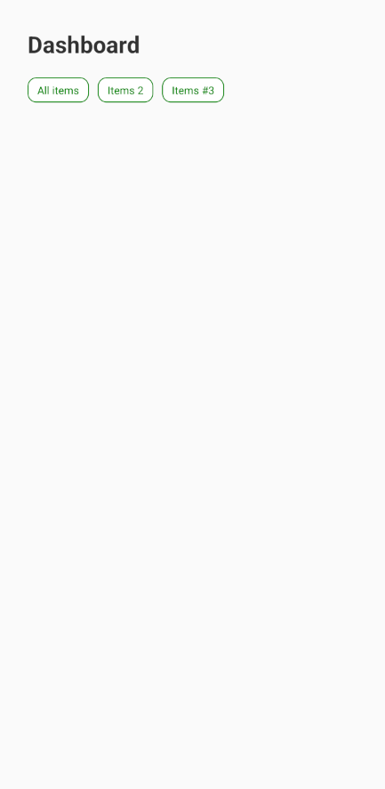
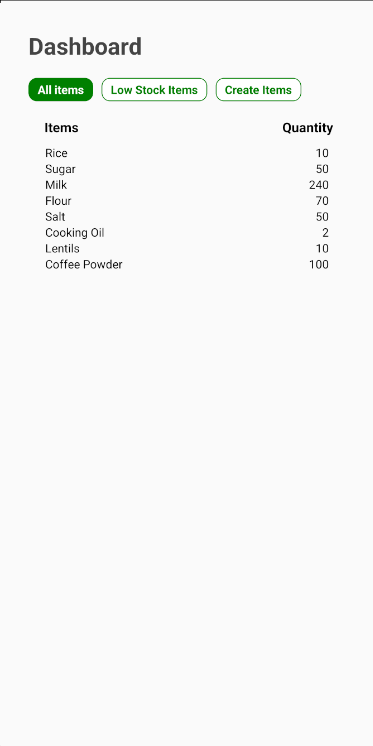

## Just applying all the basic knowledge of React Native to create this basic app.

  <video width="500" height="300" controls>
    <source src="./Progress-images/demo.mp4" type="video/mp4">
    Your browser does not support the video tag.
  </video>

### First UI

### Dynamic data fetched and basic ui
